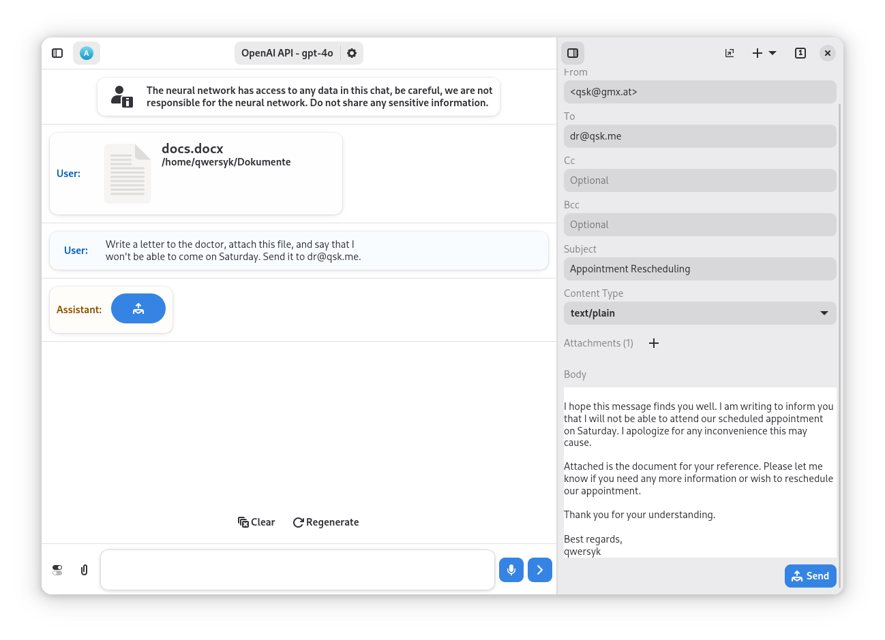
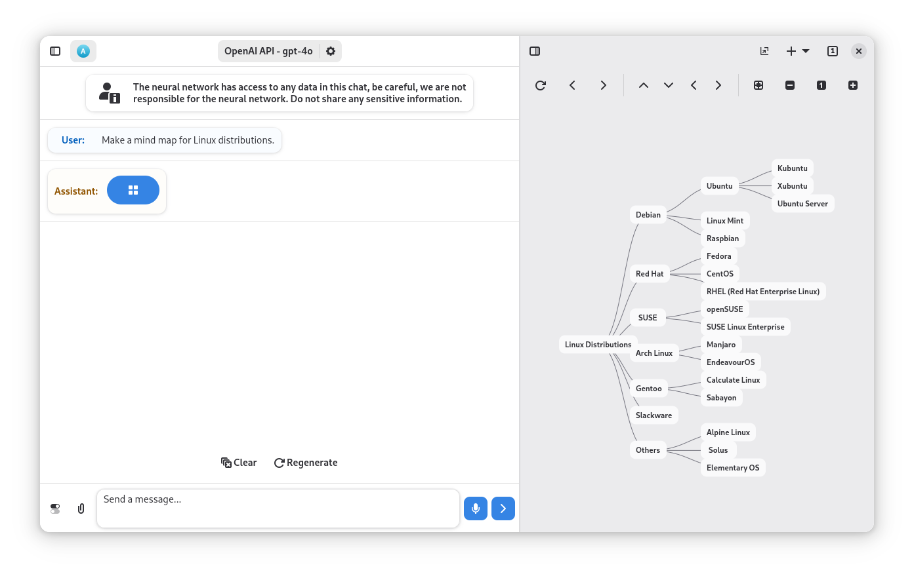

<h1 align="center">
  
   
  Newelle collection
</h1>

    <a href="https://github.com/topics/newelle-extension">
      <picture>
        <source srcset="https://raw.githubusercontent.com/qwersyk/Assets/main/newelle-extension.svg" media="(prefers-color-scheme: light)">
        <source srcset="https://raw.githubusercontent.com/qwersyk/Assets/main/newelle-extension-dark.svg" media="(prefers-color-scheme: dark)">
        
      </picture>
    </a>
    <a href="https://github.com/qwersyk/Newelle/wiki/User-guide-to-Extensions">
      <picture>
        <source srcset="https://raw.githubusercontent.com/qwersyk/Assets/main/newelle-wiki.svg" media="(prefers-color-scheme: light)">
        <source srcset="https://raw.githubusercontent.com/qwersyk/Assets/main/newelle-wiki-dark.svg" media="(prefers-color-scheme: dark)">
        
      </picture>
    </a>
     

## Emails
<a href="extensions/email.py">
    <picture>
        <source srcset="screenshots/email-w.png" media="(prefers-color-scheme: light)">
        <source srcset="screenshots/email-b.png" media="(prefers-color-scheme: dark)">
        
    </picture>
</a>

## Mindmap
<a href="extensions/mindmap.py">
    <picture>
        <source srcset="screenshots/mindmap-w.png" media="(prefers-color-scheme: light)">
        <source srcset="screenshots/mindmap-b.png" media="(prefers-color-scheme: dark)">
        
    </picture>
</a>

## Timer
<a href="extensions/timer.py">
    <picture>
        <source srcset="screenshots/timer-w.png" media="(prefers-color-scheme: light)">
        <source srcset="screenshots/timer-b.png" media="(prefers-color-scheme: dark)">
        
    </picture>
</a>

## Weather
<a href="extensions/weather.py">
    <picture>
        <source srcset="screenshots/weather-w.png" media="(prefers-color-scheme: light)">
        <source srcset="screenshots/weather-b.png" media="(prefers-color-scheme: dark)">
        
    </picture>
</a>

## Map
<a href="extensions/map.py">
    <picture>
        <source srcset="screenshots/map-w.png" media="(prefers-color-scheme: light)">
        <source srcset="screenshots/map-b.png" media="(prefers-color-scheme: dark)">
        
    </picture>
</a>

## Route
<a href="extensions/route.py">
    <picture>
        <source srcset="screenshots/route-w.png" media="(prefers-color-scheme: light)">
        <source srcset="screenshots/route-b.png" media="(prefers-color-scheme: dark)">
        
    </picture>
</a>